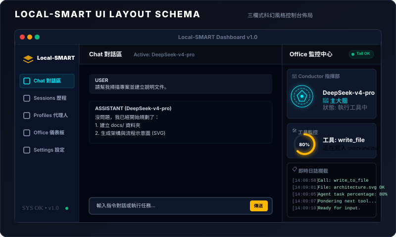
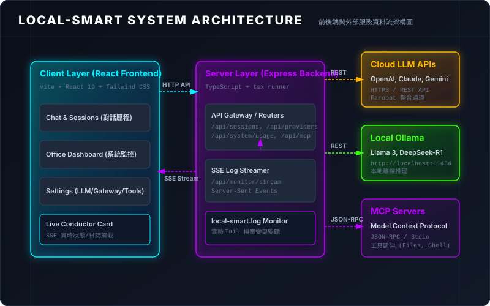
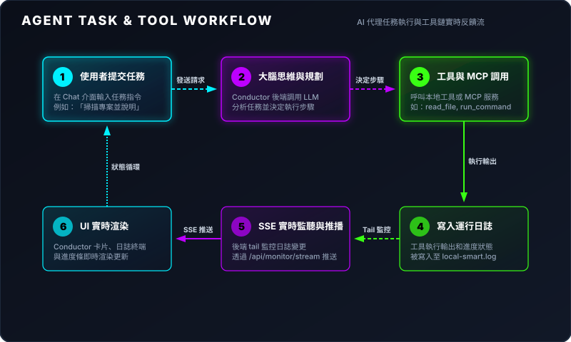

# Local-SMART 本地 AI 桌面控制台 (Local AI Desktop Controller)

歡迎使用 **Local-SMART**！這是一個專為本地 AI 工作流與自主代理（Agent）設計的科幻風格桌面圖形控制面板（Desktop Controller）。

本專案深度整合 **React 19 + Tailwind CSS v4** 前端、**Express** 後端服務，並支援 **Electron 原生桌面視窗模式** 與 **Python AI 後端（far_swarm_ai_local）進程生命週期控制**。核心特色是常駐於右側的 **Office 監控中心**，透過 Server-Sent Events (SSE) 實時 tail 後台運行日誌，動態可視化展現 AI 代理（如 DeepSeek-v4-pro, gpt-5.3-codex, mistral 等）的思維規劃、工具執行進度與實時終端日誌。

---

## 🖥️ 介面佈局說明 (Interface Layout)

Local-SMART 介面採用極速響應的**三欄式佈局**，將導覽、工作區與實時監控完美整合：



1. **左側導覽列 (Sidebar Navigation)**：
   - 快速切換主功能版面：**對話區 (Chat)**、**會話歷程 (Sessions)**、**代理人設定檔 (Agents)**、**診斷儀表板 (Office)**、**系統設定 (Settings)**。
   - 底部實時顯示後端連線狀態與系統版本號。
2. **中間工作區 (Center Workspace Panel)**：
   - **Chat 對話區**：支援流式輸出對話、Markdown / 表格解析、圖片多模態上傳與 Agent 工具調度。
   - **Sessions 歷程**：以網格卡片呈現所有歷史會話的日期、ID 與內容預覽。
   - **Agents 代理人**：設定 AI System Prompt、角色定位與沙箱執行權限。
   - **Office 儀表板**：展示 CPU 負載、記憶體與 GPU/VRAM 實時使用率，以及 MCP 伺服器狀態。
   - **Settings 設定**：管理 LLM Providers (OpenAI, Claude, Ollama 等)、SSH 網關、工具權限與知識庫目錄。
3. **右側監控中心 (Right Dashboard Monitoring Panel)**：
   - **Conductor 指揮部**：顯示當前主導的 AI 模型，並以旋轉星軌與動態發光 Avatar 反應 AI 運算狀態。
   - **工具執行監控**：顯示圓形進度環與即時百分比，實時反饋 AI 當前調用的工具（如 `run_command`、`read_file`、`write_file`）。
   - **即時日誌攔截終端**：透過 SSE 實時攔截後端 Agent 產生的日誌，高亮呈現並平滑滾動。

---

## 🏗️ 系統架構與資料流 (Architecture & Data Flow)

系統採用輕量級前後端分離設計，兼具極低的本地延遲與即時的日誌反饋：



### 核心通訊機制 (SSE Log Monitor)
1. **持久連線**：前端透過 `EventSource('/api/monitor/stream')` 與 Express 後端建立 SSE 連線。
2. **實時 Tail 監控**：後端定時輪詢日誌檔案大小（`fs.statSync`），使用檔案指標（File Descriptor）增量讀取最新內容。
3. **智慧模式匹配 (Regex Parsing)**：
   - 匹配 `model=...` 自動切換主導 AI 模型頭像與角色。
   - 匹配 `agent.tool_executor: tool [tool_name]` 自動更新當前執行工具與進度環百分比。
   - 匹配 `Turn ended:` 自動將進度推至 100% 並重置為待命狀態。

---

## 🔄 AI 代理人工作流 (Agent & Tool Workflow)

Local-SMART 支援自主代理人的完整任務調度閉環：



1. **任務輸入 (User Input)**：使用者於 Chat 輸入自然語言任務。
2. **思維規劃 (Planning)**：Conductor 呼叫大腦模型啟動思維鏈，決定工具調用步驟。
3. **工具分派 (Tool Dispatch)**：自動執行受控 Shell 指令、檔案讀寫或 MCP 伺服器 JSON-RPC 呼叫。
4. **日誌攔截 (Log Capture)**：即時捕獲執行狀態與工具輸出。
5. **動態渲染 (Reactive UI)**：右側面板星軌動畫、進度環與終端日誌同步更新。

---

## ⚡ 新電腦環境一鍵快速啟動 (Quick Start)

專案提供自動化環境檢測腳本，在新電腦上克隆本倉庫後，**只需執行一行指令**即可全自動安裝 Node 依賴、建立 Python 虛擬環境、編譯後端並開啟桌面視窗：

### Linux / macOS
```bash
./start.sh
```

- **其他常用啟動模式**：
  ```bash
  # 1. 桌面模式並同步啟動 Python AI 後端 (far_swarm_ai_local)
  ./start.sh desktop --with-python

  # 2. 僅以瀏覽器網頁模式啟動 (Web Mode: http://localhost:5173)
  ./start.sh web

  # 3. 若背景已在執行服務，僅快速喚起原生桌面視窗
  ./start.sh window

  # 4. 僅進行全環境初始化安裝 (Node 套件 + Python .venv + requirements.txt)
  ./start.sh setup
  ```

### Windows
```cmd
start.bat
```

---

## 🛠️ 手動開發指令 (Manual Commands)

```bash
# 1. 安裝前端與後端依賴
npm install

# 2. 編譯 TypeScript 後端服務
npm run build:backend

# 3. 啟動桌面模式 (Vite 前端 + Electron 原生視窗)
npm run dev:desktop

# 4. 啟動傳統網頁模式 (Express :8000 + Vite :5173)
npm run dev

# 5. 快速喚起桌面視窗 (復用既有後端)
npm run desktop:window

# 6. 生產環境建置打包
npm run build
```

---

## 🐍 Python AI 後端整合 (far_swarm_ai_local)

本專案內建 Python 進程管理模組（`src/main/python-manager.ts`），支援自動優先搜尋 `.venv` 虛擬環境，並提供生命週期開關與 REST API 控制：

- **環境變數自動啟動**：
  ```bash
  ENABLE_PYTHON_BACKEND=true npm run dev:desktop
  ```
- **REST API 控制**：
  - `GET  /api/python/status`：查詢 Python 服務運作狀態、PID、通訊埠與虛擬環境路徑。
  - `POST /api/python/start`：手動/動態啟動 Python AI 後端。
  - `POST /api/python/stop`：安全關閉 Python 進程（退出視窗時也會自動清理）。

---

## 📚 詳細文檔導覽 (Documentation)

若需進一步了解底層細節，請參閱 `docs/` 目錄下的專案說明文檔：

1. **[專案總覽 (Overview)](docs/overview.md)**：設計理念、三欄式科幻佈局與技術棧明細。
2. **[系統架構與通訊 (Architecture)](docs/architecture.md)**：後端路由規劃、SSE Stream 實作與 React 狀態綁定。
3. **[功能模組細節 (Features)](docs/features.md)**：各個操作畫面代碼位置、API 端點與配置儲存。
4. **[AI 代理人工作流 (Workflow)](docs/workflow.md)**：Conductor 思考規劃、工具分派與日誌攔截閉環。
